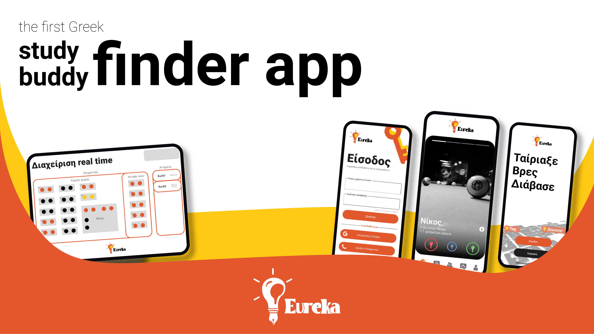

 # Eureka.


We are a generation characterized by procrastination.
One solution and solution to this, commonly used by students and not only, are the study cafes.
There, a load of reading/work is done, which under other circumstances at home would not be completed, or at least not at this degree.
This is something we talk to you derived from experience and confirmed by scientific articles.
The current readme.md that you read now is been written in "tag", a well-known study cafe in Patras.

However, a problem that arises is that not all of our acquaintances are comfortable with the reading room and we end up going solo, if we go, which is not that efficient.
And that's something normal and perfectly understandable. Either because they can't focus together with so many people, or because they arrange with groups that have joint labs,
 or because in the end the ours doesn't add up.

So first as students and then as computer engineers,
we came up with Eureka, the first Greek study buddy finder app.

---

## Folder Structure
```
.
|--.vscode                      # Nessasary Visual Studio Code directory.
|
|--AdminView/admin              # All the code for the Admin's View is here to check it out and play with it.
|
|--Backend                      # All the backend code is here to check it out and play with it.
|
|--Code/eureka                  # All the code for the Client's View is here to check it out and play with it.
|
|--Phases                       # Documentation Files For each Phase.
|  |--Phase 1                   
|  |--Phase 2                   
|  |--Phase 3                   
|  |--Phase 4                   
|
|--ShopView/s                   # All the code for the Shop's View is here to check it out and play with it.
|
|-LICENSE                       # The Project's License.
|-README.md --> This File.

```

## Execution Instructions

Please follow our step guide for the installation from the file "project-code-v1.0.pdf".
file path: 

### Cloning the project repository
- In order to clone our project you must first check if you have downloaded Git in your computer.  
- If you haven't please do it and then continue with the next steps.  
- Clone the repository (https://github.com/NickMavrias/TL.git), then go to File -> New -> Project from version control -> Git.  
- Paste the link and click "Test" , if the connection is successful click "Clone" otherwise check
again your Git installation.

## Disclaimer

Eureka was created as a University Project for the Department of Computer Engineering & Informatics. As such, it is not a fully functional software product and it's not meant for commercial use. The main objective of the Project is to simulate software development workflows and not to produce a functional product.
